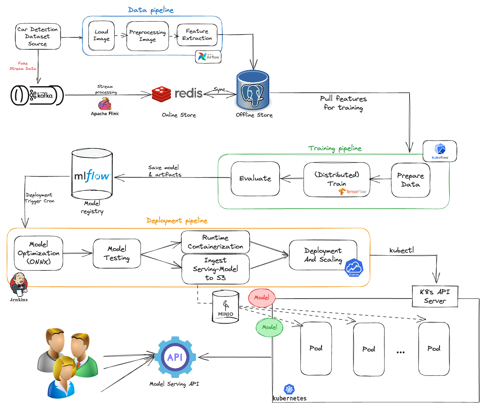

#  Scalable ML System for Car Detection

## 📕 Table Of Contents
- 🗣️ [Introduction](#Introduction)
- 🚀 [Challenge](#Challenge)
- 🌟 [System Architecture](#System-architecture)
- 📁 [Repository Structure](#repository-structure)
- 🔍 [How to Guide](#how-to-guide)

## 🗣️ Introduction:

This project implements an advanced car detection system using a comprehensive machine learning pipeline. Our solution leverages state-of-the-art technologies to process data, train models, and deploy them efficiently at scale.

## 🚀 **Challenge:**
This project faced several challenges including ensuring data consistency and scalability during ingestion, managing resources and synchronization in distributed training, automating CI/CD pipelines, converting and deploying models efficiently, ensuring data privacy and security, optimizing performance, and handling the complexities of debugging and troubleshooting in a distributed system.


## 🌟 System Architecture


The pipeline consists of two main components:

- **Data Pipeline**: This part of the system handles the ingestion, preprocessing, and feature extraction of car detection data. It includes steps like loading the dataset, performing preprocessing tasks, and extracting relevant features using tools like Apache Flink and Redis.
- **Training and Deployment Pipeline**: The training and deployment pipeline focuses on the model development and deployment processes. It includes steps like saving the trained model and artifacts, evaluating the model, and deploying the model using tools like MLflow, Jenkins, and Kubernetes.


**Key features of our pipeline include:**

- Data ingestion and preprocessing using Airflow and Kafka for stream processing
- Feature storage in Redis and an offline data store
- Distributed model training with TensorFlow on Kubeflow
- Model versioning and artifact management with MLflow
- Automated deployment pipeline using Jenkins and Kubernetes
- Scalable model serving with KServe API server


## 📁 Repository Structure
```
📦
├─ .env                      # Environment variables used across the project
├─ Jenkinsfile               # Configuration for a Jenkins CI/CD pipeline
├─ README.md                 # General project documentation
├─ api                       # Contains code related to the API layer
│  ├─ README_serve.md        # Documentation for the API serving component
│  ├─ triton_client.py       # Code for interacting with the Triton Inference Server
│  └─ upload_model_to_minio.py # Script to upload the trained model to Minio storage
├─ constants.py              # Shared constants and configurations used across the project
├─ deployments               # Kubernetes configurations
│  ├─ mwt.yaml               # Configuration for the Multi-Worker Training (MWT) component
│  ├─ triton-isvc.yaml       # Configuration for the Triton Inference Service
│  └─ triton-servingruntime.yaml # Configuration for the Triton Inference Server runtime
├─ distributed_training      # Code and configuration for distributed training
│  ├─ Dockerfile             # Dockerfile for the distributed training component
│  ├─ README_distributed.md  # Documentation for the distributed training component
│  ├─ build.sh               # Script to build the distributed training Docker image
│  ├─ mwt.py                 # Main logic for the Multi-Worker Training component
│  ├─ nets                   # Neural network architecture definitions
│  │  └─ nn.py               # Neural network model implementation
│  ├─ test                   # Test configuration for the distributed training
│  │  └─ test.yaml           # Test deployment configuration
│  ├─ utils                  # Utility functions for the distributed training
│  │  ├─ config.py           # Configuration handling for the distributed training
│  │  ├─ dataset.py          # Dataset-related utilities
│  │  └─ image_utils.py      # Image processing utilities
│  └─ weights                # Folder containing a pre-trained model
│     └─ model.h5            # Saved weights for the pre-trained model
├─ docker-compose.yml        # Docker Compose configuration for the entire project
├─ images                    # Folder for storing project-related images
├─ mlflow                    # Code and configuration for the MLflow component
│  └─ Dockerfile             # Dockerfile for the MLflow component
├─ model_repo                # Repository for storing the trained model
│  └─ yolov8n_car            # Folder for the YOLOv8 car detection model
│     ├─ 1                   # Version 1 of the model
│     │  └─ model.onnx       # ONNX format of the trained model
│     └─ config.pbtxt        # Triton Inference Server configuration for the model
├─ notebooks                 # Folder for Jupyter Notebooks (likely for debugging/exploration)
│  └─ debug.ipynb            # Sample Jupyter Notebook for debugging
├─ requirements.txt          # Python dependencies for the project
└─ streaming                 # Code and configuration for the data streaming component
   ├─ Dockerfile             # Dockerfile for the streaming component
   ├─ README_streaming.md    # Documentation for the streaming component
   ├─ docker-compose.yml     # Docker Compose configuration for the streaming component
   ├─ kafka_connector        # Configuration for the Kafka connector
   │  └─ connect-timescaledb-sink.json # Kafka connector configuration for TimescaleDB sink
   ├─ produce.py             # Script to produce sample data for the streaming component
   └─ run.sh                 # Script to run the streaming component
```

## 🔍 How to Guide:

### 1. Data Pipeline:
- The data pipeline starts with the Car Detection Dataset Source.
- Images are loaded, preprocessed, and features are extracted using Airflow.
- We also use Kafka for stream processing of fake stream data, which is then processed by Apache Flink.
- Data is stored in Redis (online store) and synced to PostgreSQL (an offline store).

To get started with the *Data pipeline* component:
```shell
cd streaming
```

And read the respective README file: [Data Pipeline Guide](https://github.com/HungNguyenDev1511/Car-detection-serving-model/blob/refactor/streaming/README_streaming.md)

### 2. Training Pipeline:
Our training pipeline utilizes Kubeflow and TensorFlow for distributed training. Here's an overview of the process:

1. Data Preparation: Features are pulled from the offline store and prepared using Kubeflow.

2. Distributed Training: We use TensorFlow for distributed training, which allows us to process large datasets efficiently across multiple nodes.

3. Model Evaluation: After training, the model is evaluated to ensure it meets performance criteria.

4. Artifact Management: The trained model and associated artifacts are saved to the MLflow model registry for versioning and easy retrieval.

Key features of our distributed training approach:
- Scalability: Easily scale training across multiple nodes using Kubeflow.
- Efficiency: Utilize TensorFlow's distributed training capabilities for faster processing.
- Version Control: Track experiments and models using MLflow for reproducibility.

To get started with the training pipeline:

```shell
cd distributed_training
```

For detailed instructions on setting up and running the distributed training, please refer to our [Distributed Training Guide](https://github.com/HungNguyenDev1511/Car-detection-serving-model/blob/refactor/distributed_training/README_distributed.md).


Here's an updated version of the serving pipeline section in your README to match the style of the previous parts you've edited:

### 3. Serving Pipeline:
The serving pipeline deploys the trained model for inference, ensuring that it can handle various workloads efficiently. Below are the key aspects of our serving approach:

1. **Scalability**: ModelMesh scales the serving infrastructure dynamically to accommodate varying loads and large volumes of requests, ensuring reliable performance even under heavy demand.

2. **Multi-Model Support**: ModelMesh can manage and serve multiple models simultaneously, providing flexibility in deployment strategies and enabling seamless model updates.

3. **Efficient Resource Utilization**: By dynamically allocating resources based on the demand for different models, ModelMesh optimizes the use of computational resources, reducing costs and improving efficiency.

To get started with the serving pipeline:

```shell
cd api
```

For detailed instructions on setting up and managing the serving infrastructure, please refer to our [Serving Pipeline Guide](https://github.com/HungNguyenDev1511/Car-detection-serving-model/blob/refactor/api/README_serve.md).