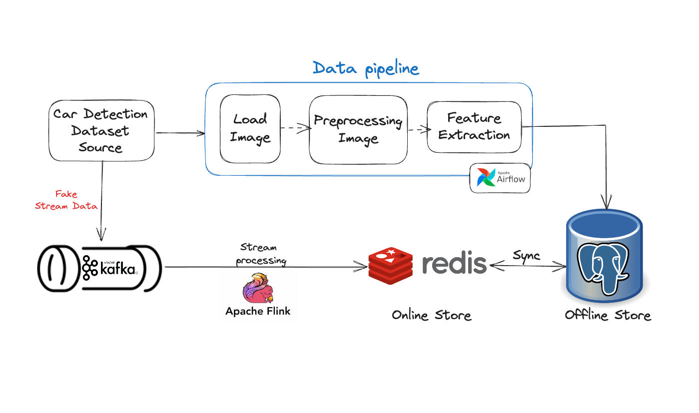

# Data Pipeline Guide
## Table of Contents
1. [Introduction](#introduction)
2. [Dataset Setup](#dataset-setup)
   - [Downloading the Dataset](#downloading-the-dataset)
   - [Folder Structure](#folder-structure)
3. [Kafka and Flink Setup](#kafka-and-flink-setup)
   - [Starting Docker Compose](#starting-docker-compose)
   - [Accessing Kafka Control Center](#accessing-kafka-control-center)
4. [Viewing Kafka Topics](#viewing-kafka-topics)
   - [Accessing the Topics Tab](#accessing-the-topics-tab)
   - [Viewing Topic Messages](#viewing-topic-messages)
5. [Adding Kafka Connector](#adding-kafka-connector)
6. [Verifying Data in PostgreSQL](#verifying-data-in-postgresql)
7. [Note](#note)

---

## Introduction
In this step, we focus on the real-time data processing component of our pipeline. The goal is to simulate and process streaming data to enhance the robustness of our data pipeline. 

👉 We achieve this by leveraging **Kafka** for stream ingestion and **Apache Flink** for stream processing.

**Note:** In this project, Kafka acts as the backbone for stream data ingestion, handling both real and simulated (fake) stream data. **Apache Flink** processes this data in real-time, ensuring that the processed data is available in our **Redis** online store. Redis, in turn, is synced with our **PostgreSQL** offline store, providing a unified data storage solution.

Key steps in this process include:

1. **Kafka Producer Setup**: The Kafka producer service is responsible for continuously sending data streams. You can customize the message format, bind data to messages, and specify the Kafka topic for message distribution.

2. **Stream Processing with Apache Flink**: Flink processes the incoming data streams, transforming them into a format suitable for storage in Redis. This ensures that data is available for immediate use in both real-time and batch processing scenarios.

3. **Data Syncing**: Redis, serving as the online store, is synced with PostgreSQL to maintain consistency between real-time and offline data.

For more details on setting up the Kafka producer and configuring Flink for stream processing, refer to the [Confluent PostgreSQL Sink Guide](https://docs.confluent.io/cloud/current/connectors/cc-postgresql-sink.html#step-6-check-the-results-in-postgresql).

# Dataset Setup

## Downloading the Dataset:
To begin, download the dataset required for streaming from the following link: [Dataset Link](https://drive.google.com/drive/folders/12ncEAoWT_kwuPT8YRdFysqgS54XJwre7?usp=drive_link)

## Folder Structure
The structure of the folder will be like this:

  

# Kafka Flink Setup

## Starting Docker Compose
If you haven't already done so in previous steps, start the Docker Compose setup to launch the necessary services.

## Accessing Kafka Control Center
Once Docker Compose is running, you can access the Kafka Control Center by navigating to `https://localhost:9021`. This interface allows you to manage and monitor your Kafka cluster.

# Viewing Kafka Topics

## Accessing the Topics Tab
To view the available Kafka topics, click on the `Topics` tab within the Kafka Control Center. You can follow the steps outlined in the image below:

## Viewing Topic Messages
Select a specific topic (e.g., `image 0`) to view the messages being transmitted:

# Adding Kafka Connector
To ensure that messages are forwarded to PostgreSQL, you will need to add a Kafka connector. An example configuration file, `connect-timescaledb-sink.json`, is provided in this repository for your reference:

# Verifying Data in PostgreSQL
Finally, after setting up the Kafka connector, verify that the data has been successfully transferred to PostgreSQL. You can do this by querying the database using SQL to confirm that the data is correctly stored and ready for training.

# Note
Before proceeding to data verification, ensure that the Kafka connector is properly configured and operational. This step is crucial for the successful transmission of data from Kafka to PostgreSQL.
